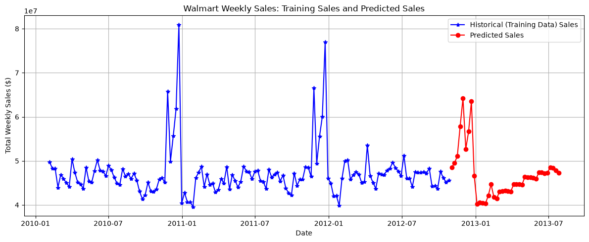
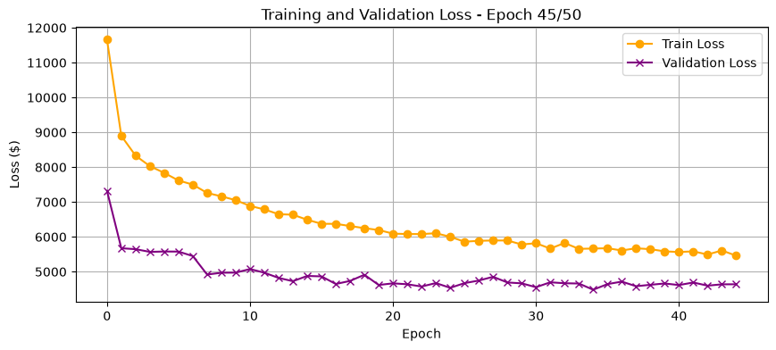
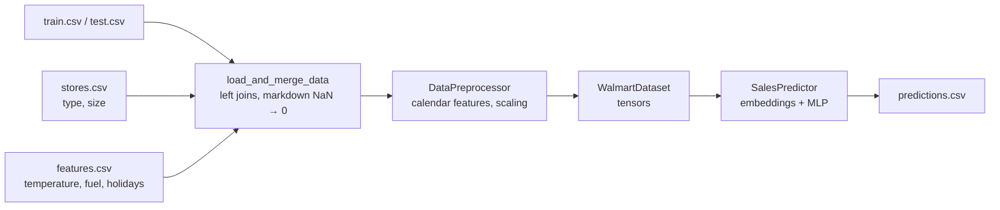

# showcase-time-series

[](https://github.com/cruzas/showcase-time-series/actions/workflows/ci.yml)
[](LICENSE)
[](.github/workflows/ci.yml)
[](https://pytorch.org)
[](https://github.com/astral-sh/ruff)

**Weekly sales forecasting for 45 Walmart stores. It is a small, readable
end-to-end ML pipeline built with pandas, scikit-learn and PyTorch.**

The repository takes the raw Walmart CSVs, joins them into a single table,
engineers calendar features, trains a neural network with learned embeddings
for each store and department, and forecasts nine months of sales that the
model has not seen. The code is written for reading. Each step is its own
small module, and the comments explain *why* each step is there as well as
what it does.



*Total weekly sales across all stores. The blue line is history. The red line
is the model's forecast for the test period, from November 2012 to July 2013.
The model learnt the holiday peaks from the calendar features alone.*

## Highlights

- **Leak-free time-series validation.** The model trains on 2010–2011 and is
  validated on 2012. Scalers and encoders are fitted on the training years
  only and then reused, so the validation score never sees future statistics.
- **Categorical embeddings, not ordinal IDs.** Store and department IDs go
  through `nn.Embedding` layers. Store 45 is not "bigger" than store 1, and the
  network is not told that it is.
- **Separate feature groups.** Continuous features are standardized. IDs are
  embedded. The target is scaled on its own, so the loss can be converted back
  to dollars.
- **Reproducible and tested.** The notebook sets its seeds, the best checkpoint
  is committed, and CI checks the whole pipeline on every push.

## Results

The committed checkpoint ([`saved_weights/best_model.pth`](saved_weights/best_model.pth))
was scored on the 2012 hold-out (127,438 store–department–week rows, from
January to October 2012). Two simple baselines are included for comparison:

| Method | RMSE ($) | MAE ($) |
| --- | ---: | ---: |
| Global mean of the training period | 22,124 | 15,156 |
| Mean of each store–department pair | 5,365 | 2,681 |
| **`SalesPredictor` (this repo)** | **4,483** | **2,458** |
| Seasonal naive (same store and department, 52 weeks earlier) | 3,845 | 1,799 |

The network has 5× lower error than predicting one number for everything, and
it clearly beats a per-series average. The seasonal-naive row matters most,
though. Copying last year's sales for the same week still wins. The model sees
*when* a week falls, but it never sees *what that series sold recently*. The
next step is therefore to add lag features, not a bigger network (see
[Where to go next](#where-to-go-next)).

<details>
<summary>Training curves</summary>



The losses are plotted as RMSE in dollars. Training stops early once the
validation error has not improved for 10 epochs, and the best weights are
restored.
</details>

## How it works



| Step | Module | What it does |
| --- | --- | --- |
| Load | [`src/data_loader.py`](src/data_loader.py) | Left-joins sales with store metadata and weekly external factors. Fills missing markdowns with 0 because Walmart only began recording discounts in November 2011. |
| Features | [`src/preprocessor.py`](src/preprocessor.py) | Extracts year, month and ISO week. Encodes store type and standardizes continuous inputs. `fit_transform` runs on training data and `transform` runs on everything else. |
| Dataset | [`src/walmart_dataset.py`](src/walmart_dataset.py) | Wraps the arrays as a PyTorch `Dataset`, with `float32` features and `long` embedding indices. |
| Model | [`src/sales_predictor.py`](src/sales_predictor.py) | Uses 10-dimensional store and department embeddings, concatenated with 8 continuous features. These feed an MLP (256 → 128 → 64 → 1) with BatchNorm, ReLU and dropout. |
| Train and infer | [`notebooks/sales_forecasting.ipynb`](notebooks/sales_forecasting.ipynb) | Runs Adam and MSE with early stopping and a live loss plot. It then forecasts on `test.csv` and writes `predictions.csv`. |

## Quickstart

```bash
git clone https://github.com/cruzas/showcase-time-series
cd showcase-time-series
python3 -m venv .venv
source .venv/bin/activate          # Windows: .venv\Scripts\activate
pip install -r requirements.txt
jupyter lab notebooks/sales_forecasting.ipynb
```

The dataset is already under `data/`, so no download is needed. Training runs
on a laptop CPU. No GPU is required.

## Repository layout

```
├── data/                   Walmart CSVs (train, test, stores, features)
├── docs/                   Figures used in this README
├── notebooks/
│   └── sales_forecasting.ipynb   end-to-end walkthrough
├── saved_weights/
│   └── best_model.pth      best checkpoint from the notebook run
├── src/                    reusable pipeline modules (see table above)
├── tests/                  pytest suite run by CI
├── requirements.txt        runtime dependencies
└── requirements-dev.txt    + pytest, ruff, pre-commit
```

## Development

```bash
pip install -r requirements-dev.txt
pre-commit install          # ruff and whitespace checks on every commit
pytest                      # about 10 s on a laptop
```

[GitHub Actions](.github/workflows/ci.yml) runs on every push and pull request
to `main` and `development`:

- **Lint and format**: `ruff check` and `ruff format --check`, with the same
  pinned ruff version as pre-commit.
- **Tests** on Python 3.11, 3.12, 3.13 and 3.14 with CPU-only PyTorch. The
  suite:
  - runs the loader against the real CSVs and checks that the joins do not add
    or drop rows;
  - checks that validation data never moves the fitted scalers;
  - checks that a few optimizer steps reduce the loss;
  - checks that the committed checkpoint still loads into the current model
    definition;
  - checks that every `src` import in the notebook resolves.
- **Coverage**: an XML report is uploaded as a build artifact. `src/` is
  currently at 100%.

Dependabot keeps the pinned GitHub Actions versions up to date.

## Where to go next

These are listed roughly in order of expected payoff:

1. **Lag and rolling features.** Add sales for the same series 1, 4 and
   52 weeks earlier, plus rolling means. The seasonal-naive baseline shows that
   this is where most of the remaining signal is.
2. **Rolling-origin cross-validation.** Replace the single 2012 hold-out with
   `TimeSeriesSplit` so the score does not depend on one split.
3. **Holiday-weighted metric.** The original Kaggle competition weights holiday
   weeks 5× (WMAE). Reporting that metric would make results comparable with
   published results.
4. **Use the dropped signals.** CPI, unemployment and the markdowns are loaded
   but not used as model inputs yet.

## Data

The data is the Walmart Recruiting store-sales dataset, taken from
[RawatMeghna/Walmart-Sales-Forecasting-using-Best-ML-algorithms](https://github.com/RawatMeghna/Walmart-Sales-Forecasting-using-Best-ML-algorithms/tree/main/Data%20Sources).
It covers 45 stores and 81 departments, with weekly data from
February 2010 to October 2012 and a test horizon to July 2013. This repository
uses the data but does not reproduce that project's approach. It takes a
different route, chosen for a simple and clean demonstration.

## Licence

[GPL-3.0](LICENSE)
